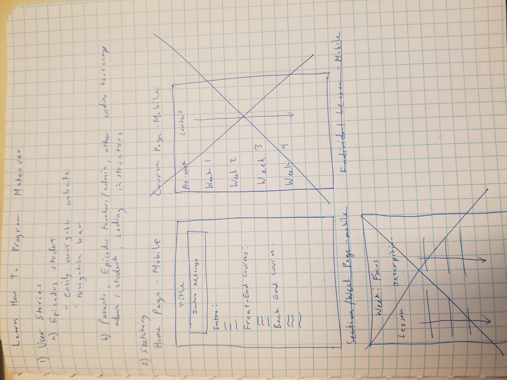
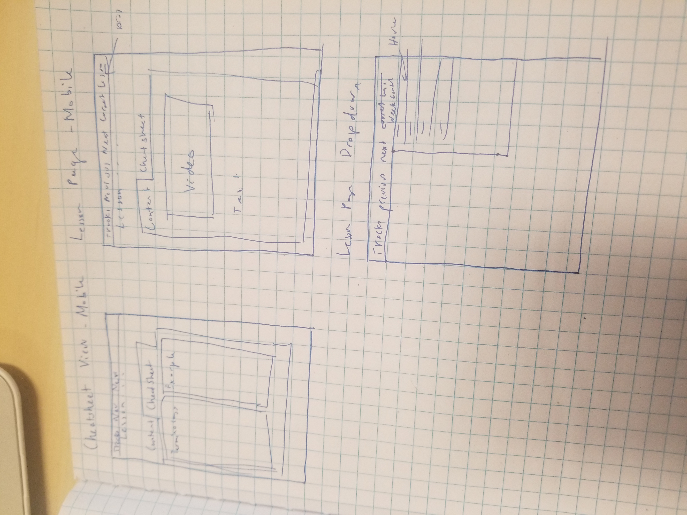

## Learn How to Program Makeover
---

#### Nelia Terrazas and Dino Nguyen
#### Date of Completion

### Description

Redesigning LHTP page

### Images

Mobile Original Sketches:

#### Desktop Version

#### Mobile Version

### User Stories

* As an Epicodus student, I want an easily navigable site so that I can quickly search/find the information that I need.
* As a non-Epicodus student/developer, I want easy access to relevant notes and lessons in each track in the form of a navigation bar/menu so that I can switch between references quickly.
* Other target audiences: parents, Epicodus teachers/admin, other coding bootcamp students/admins

### Technologies and Resources

* HTML
* CSS
* Sass
* Sketch

### Responsiveness

Describe how the site is responsive, and what different 'versions' this project includes (does it have a mobile version? tablet version? )

### Setup Instructions

Describe how someone can clone and launch this project.

### Roadmap

Is there work you plan on continuing doing on this project? Features you'd like to add?

* Consider
* Listing
* Them
* Here

### License

Determine the license under which this application can be used.

Copyright (c) 2018 **_{ List of Contributors }_**
