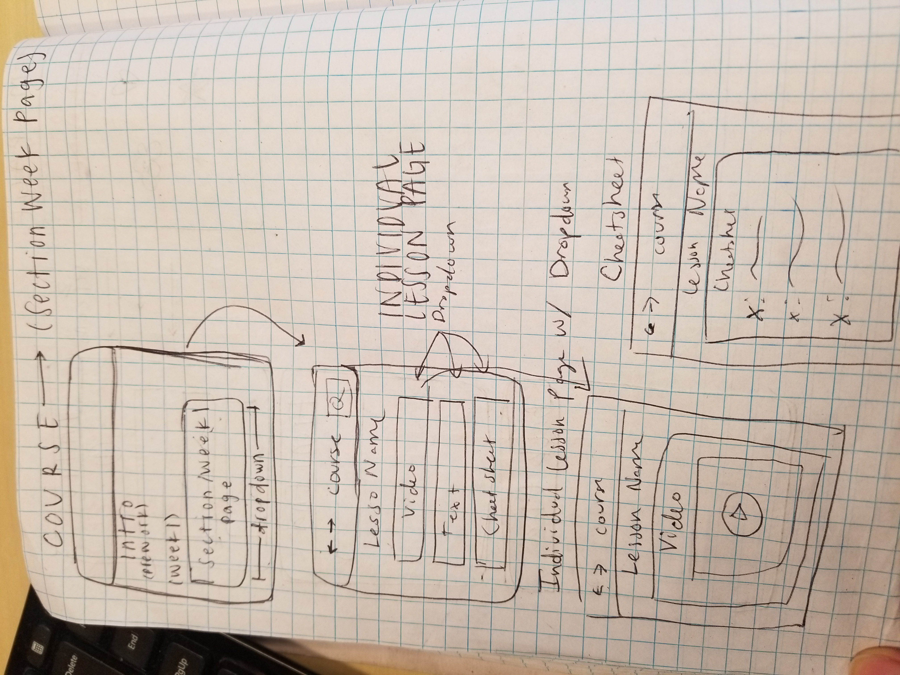
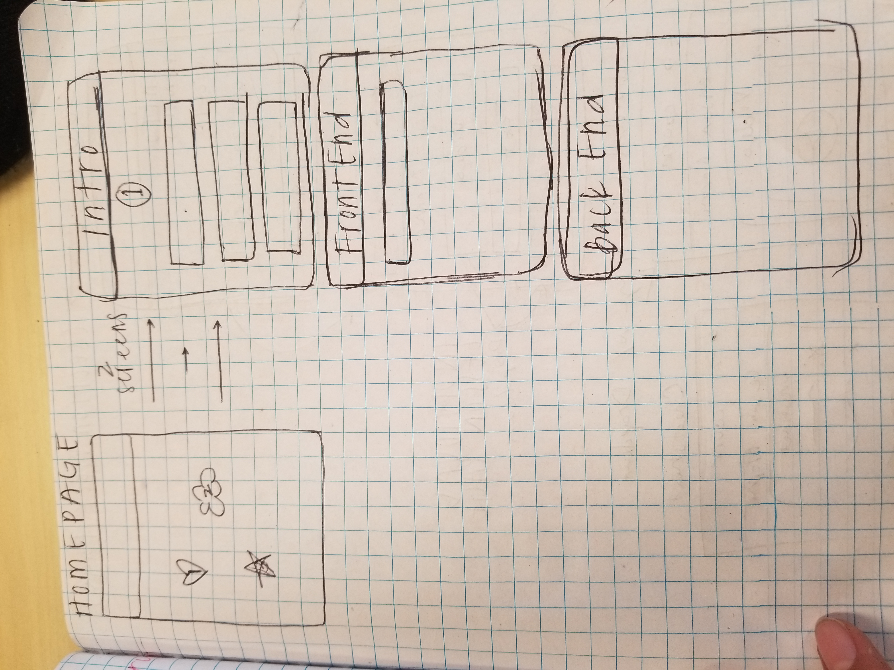
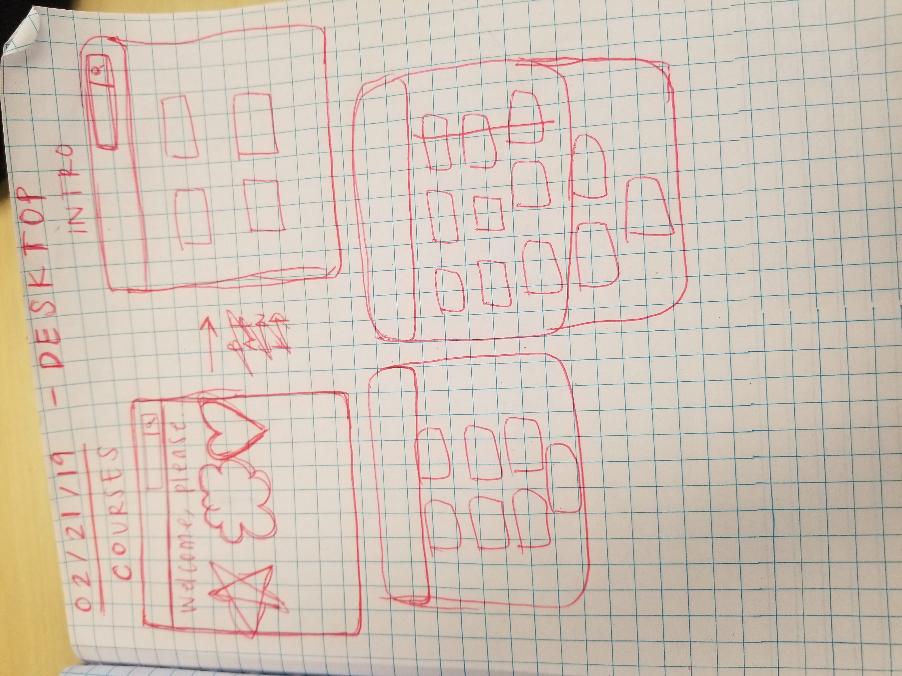
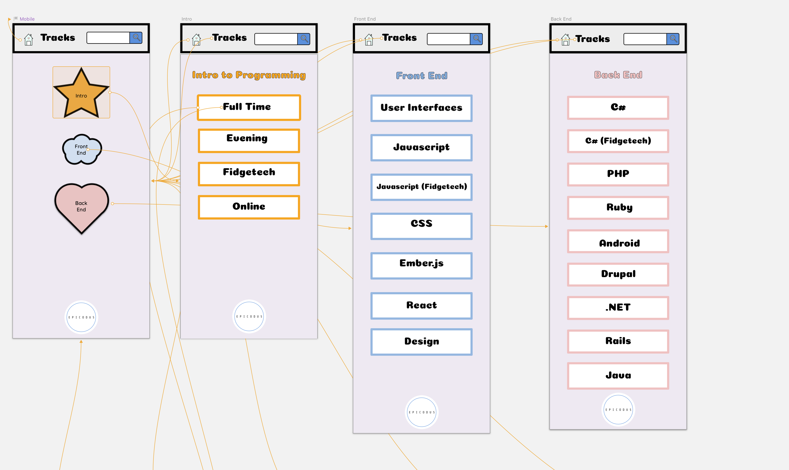
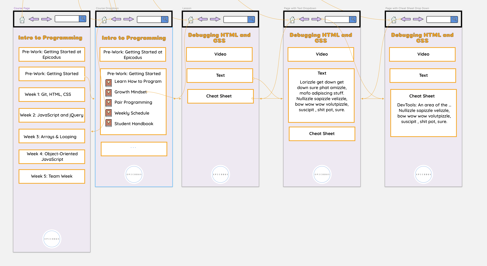
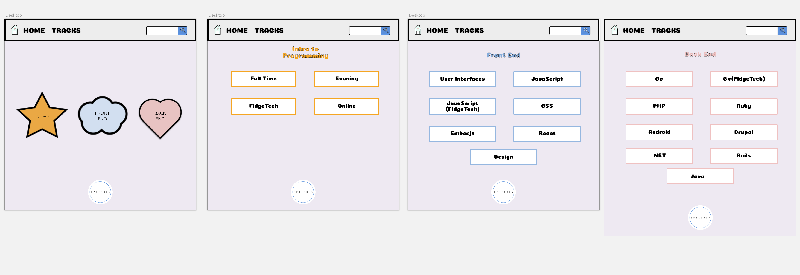

## Learn How to Program Makeover
---

#### Nelia Terrazas and Dino Nguyen
#### Date of Completion

### Description

Redesign learnhowtoprogram.com in Sketch to be more functional and appealing

### Images

Mobile Original Sketches:

Desktop Original Sketches:

#### Mobile Version

#### Desktop Version

### User Stories

* As an Epicodus student, I want an easily navigable site so that I can quickly search/find the information that I need.
* As a non-Epicodus student/developer, I want easy access to relevant notes and lessons in each track in the form of a navigation bar/menu so that I can switch between references quickly.
* Other target audiences: parents, Epicodus teachers/admin, other coding bootcamp students/admins

## Usability Research and Feedback

* Need home icon to go back to homepage
* Make hit boxes bigger
* Add back button links to make wireframe cleaner

### Technologies and Resources

* Sketch

### Setup Instructions

* Download/Clone this repository: https://github.com/neliaterrazas/lhtp-makeover.git.
* Open up in Sketch.

### License

MIT License

Copyright (c) 2018 **_{ Dino Nguyen and Nelia Terrazas }_**
